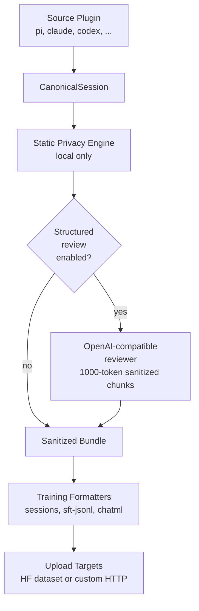
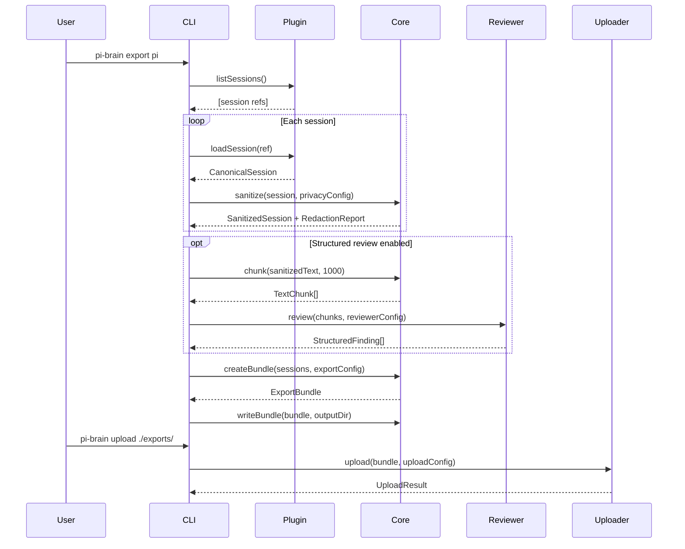

# Design Document

## Architecture



## Sequence Flow



## Config Examples

### Minimal (defaults)

```typescript
const config: PiBrainConfig = {};
// Uses all redaction categories, review disabled, sessions format
```

### Full pipeline with review and HF upload

```typescript
const config: PiBrainConfig = {
  privacy: {
    categories: ["api-key", "password", "email", "phone", "jwt"],
    customPatterns: { "internal-id": "PROJ-\\d+-SECRET" },
  },
  reviewer: {
    enabled: true,
    baseUrl: "https://api.openai.com/v1",
    model: "gpt-4o-mini",
    chunkTokens: 1000,
  },
  export: {
    formats: ["sessions", "sft-jsonl", "chatml"],
  },
  upload: {
    type: "huggingface",
    repo: "user/my-coding-dataset",
    visibility: "private",
  },
};
```

## Redaction Categories (v1)

| Category         | Examples                       | Placeholder          |
| ---------------- | ------------------------------ | -------------------- |
| api-key          | `API_KEY=abc123...`            | `<API_KEY_N>`        |
| password         | `password=hunter2`             | `<PASSWORD_N>`       |
| email            | `user@example.com`             | `<EMAIL_N>`          |
| phone            | `555-123-4567`                 | `<PHONE_N>`          |
| jwt              | `eyJhbG...`                    | `<JWT_N>`            |
| auth-header      | `Authorization: Bearer ...`    | `<AUTH_HEADER_N>`    |
| ip-address       | `192.168.1.100`                | `<IP_ADDRESS_N>`     |
| filesystem-path  | `/home/user/project/`          | `<PATH_N>`           |
| url-with-creds   | URLs with embedded credentials | `<CRED_URL_N>`       |
| labeled-personal | `name: "John Doe"`             | `<PERSONAL_N>`       |
| provider-token   | `sk-ant-...`, `ghp_...`        | `<PROVIDER_TOKEN_N>` |

## Non-Goals (v1)

- **No real-time streaming**: All processing is batch-oriented.
- **No GUI**: Commands only, no custom heavy UI.
- **No cloud processing of raw data**: Raw text never leaves the machine.
- **No full NER**: Free-form names/addresses are best-effort without structured review.
- **No multi-language support**: English patterns only in v1.

## Phase Plan

### Phase 1 (Current): Pi end-to-end

- All 15 core files implemented
- Pi, Claude, Codex, OpenCode, Cursor adapters
- Factory as typed stub
- Full privacy pipeline
- Three export formats
- HF and HTTP upload targets

### Phase 2 (Planned)

- Direct SQLite reading for Cursor (no pre-extraction needed)
- Factory adapter (when storage format is documented)
- Windsurf, Continue, Gemini, Trae adapters
- Streaming structured review
- Browser extension for web-based AI tools
